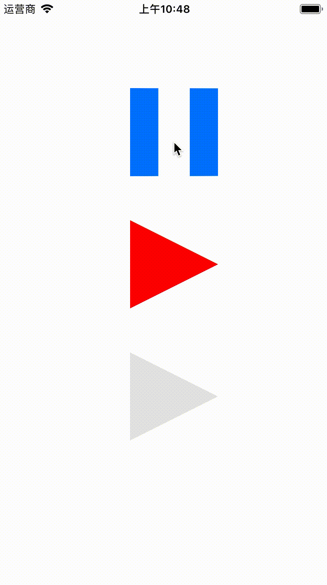

# PlayButton
A play button similar to YouTtube

## Preview

| Play Button Demonstration | An empty demo | An empty demo | 
| ------------- | ------------- | ------------- |
|   |   |   |

## Features

- Custom color
- Non-picture
- Button like YouTube
- Compact and easy to use

## Known issue
- 

## Installation 

### Requirements 

- Swift 4.2 

## Usage

```swift 

let playButton = CAPlayButton(frame: CGRect(x: 150, y: 100, width: 100, height: 100))
playButton.addTarget(self, action: #selector(caPlayButtonPressed), for: .touchUpInside)
playButton.setTintColor(bluePlayButton.tintColor)
view.addSubview(playButton)

```

## Author
<a src="https://github.com/weifans">

</a>


Does your organization or project use PhotoBrowse? Please let me know by email.

- weifans, duanhaisi@gmail.com
- SLEEP WIND https://sleepwind.com

## License 

PhotoBrowse is available under the MIT license. See the LICENSE file for more info.
